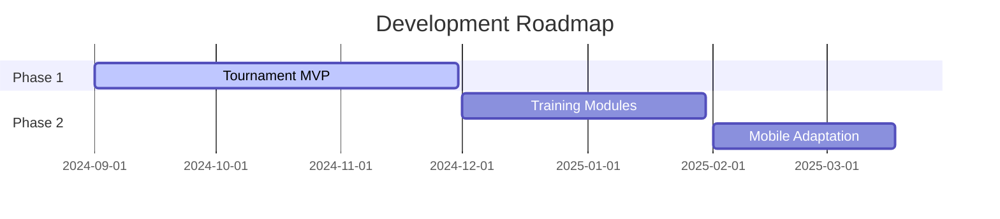

# **♟️ Scorpion Chess Kingdom Platform**  
*A Next-Generation Chess Ecosystem for Players, Coaches, and Organizers*

## **🚀 Overview**  
This open-source platform revolutionizes chess education and tournament management by combining:  
- **Automated tournament systems** (Swiss, Round Robin, and Knockout pairings)  
- **AI-powered training tools** (Personalized game analysis, puzzle generators)  
- **Community hub** (Clubs, forums, and live event streaming)  
- **FIDE-integrated rating management**  

Built for **Scorpion Chess Kingdom (Pvt) Ltd** to digitize their academy operations and expand global reach.

## **✨ Key Features**  
| Module | Highlights |  
|--------|------------|  
| **Tournament Engine** | Real-time pairings, anti-cheating detection, prize distribution |  
| **Learning Portal** | Interactive courses, coach-assigned drills, progress analytics |  
| **Player Dashboard** | Rating tracker, game database, performance heatmaps |  
| **Admin Console** | Bulk user management, content moderation, federation reporting |  

## **🛠️ Tech Stack**  
- **Frontend**: React.js + TypeScript (PWA compatible)  
- **Backend**: Node.js (Express) / Python for AI components  
- **Database**: PostgreSQL (relational) + MongoDB (game storage)  
- **Chess Logic**: Stockfish.js + Custom rating algorithms  
- **DevOps**: Docker, AWS ECS, GitHub Actions CI/CD  

## **🌐 Live Demo**  
[scorpion-chess-demo.com](https://) *(Coming Q1 2025)*  

## **📌 Project Status**  


## **🤝 How to Contribute**  
We welcome:  
1. **Developers**: Help build tournament logic or UI components  
2. **Chess Experts**: Improve training content/puzzle sets  
3. **Testers**: Stress-test our pairing algorithms  

**Getting Started**:  
```bash  
git clone https://github.com/scorpion-chess/platform.git  
cd platform && npm install  
# See CONTRIBUTING.md for API setup  
```  

## **📜 License**  
GNU GPLv3 (Open for academic/commercial use with attribution)  

**🏆 Supported by FIDE** – Recognized as an official digital development partner  


